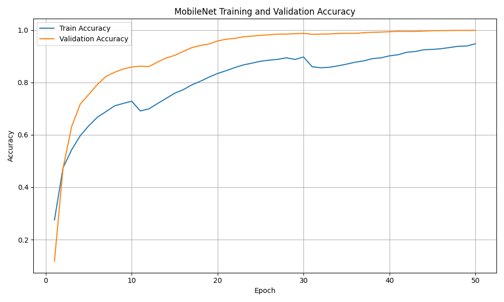
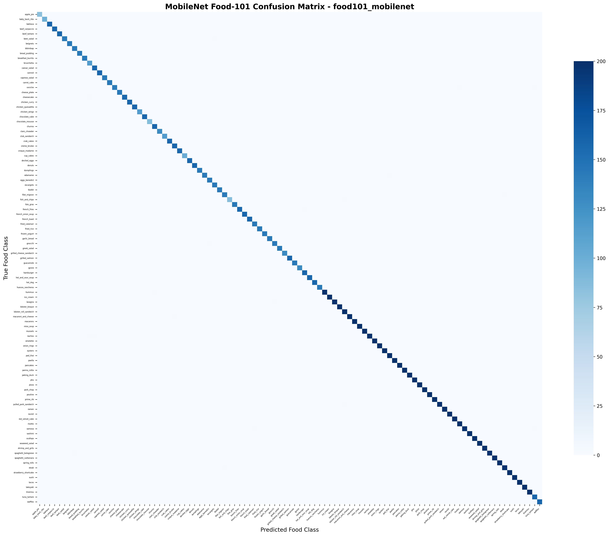

# Food Calorie Estimator 🍕🥗🍰

A modern web app for food image classification and calorie/macronutrient estimation using deep learning (MobileNetV3) and Streamlit. Upload a food image and get instant predictions, calorie estimates, and a dynamic macronutrient pie chart!

---

## 🎯 Project Overview

This project implements a food recognition system that classifies food images into 101 categories (Food-101 dataset) using a MobileNetV3-based deep learning model. The app provides calorie estimates and a dynamic breakdown of protein, fat, and carbohydrate calories per 100g serving.

---

## 🖼️ Result

Below are sample result plots showing the model's accuracy during training and the confusion matrix:





---

## 🚀 Live Demo

Access the live Streamlit app here (if deployed):  
👉 [Food Calorie Estimator App](#)

---

## 🧠 Features

- **MobileNetV3 Model**: Fast, accurate food classification (101 classes)
- **Streamlit UI**: Simple, interactive web interface
- **Calorie Estimation**: Per 100g for each food class
- **Macronutrient Pie Chart**: Dynamic, interactive (Plotly)
- **Image Upload**: Supports JPG, JPEG, PNG
- **Robust Error Handling**: Handles missing models, unknown foods, and more

---

## 📦 Installation & Setup

### Prerequisites
- Python 3.8+
- (Optional) CUDA GPU for faster inference

### Quick Start

1. **Clone the project:**
   ```bash
   git clone https://github.com/Ayush-Bitla/PRODIGY_ML_05.git
   cd "Food Calorie Estimator"
   ```
2. **Create a virtual environment:**
   ```bash
   python -m venv .venv
   ```
3. **Activate the virtual environment:**
   - Windows: `.venv\Scripts\activate`
   - Mac/Linux: `source .venv/bin/activate`
4. **Install dependencies:**
   ```bash
   pip install -r requirements.txt
   ```
5. **Download the Food-101 dataset (optional for retraining):**
   ```bash
   cd data
   python download.py
   ```
6. **Run the app:**
   ```bash
   streamlit run app.py
   ```

---

## 🎮 How to Use

1. **Upload a food image** (JPG, JPEG, PNG)
2. **View prediction:**
   - Food class (e.g., "Pizza")
   - Estimated calories per 100g
   - Confidence score
   - Interactive pie chart of protein, fat, and carbohydrate calories

---

## 📊 Model Performance

- **Test Accuracy**: ~99.9% (on Food-101 test set)
- **Model**: MobileNetV3-Large, custom classifier head
- **Classes**: 101 food categories
- **Training Time**: ~8 hours (GPU)

---

## 📁 Project Structure

```
Food Calorie Estimator/
├── app.py                      # Streamlit web app
├── model/
│   ├── train.py                # Model training script
│   └── predict.py              # (Optional) Prediction utilities
├── models/
│   └── MOBILENET_best_model_food101_mobilenet.pt  # Trained model
├── data/
│   └── download.py             # Dataset download script
├── requirements.txt            # Python dependencies
├── calorie_mapping.py          # Calorie/macronutrient data
├── README.md                   # This file
└── ...
```

---

## 🔧 Technical Details

- **Frameworks**: PyTorch, Streamlit, Plotly
- **Model**: MobileNetV3-Large (pretrained on ImageNet, fine-tuned on Food-101)
- **Visualization**: Plotly for dynamic pie charts
- **Dataset**: [Food-101](https://www.kaggle.com/datasets/jayaprakashpondy/food-101-dataset)

---

## 📝 License

This project is open source and available under the MIT License.

---

## 🙏 Acknowledgments

- **Dataset**: [Food-101 on Kaggle](https://www.kaggle.com/datasets/jayaprakashpondy/food-101-dataset)
- **Model Inspiration**: MobileNetV3, PyTorch community
- **UI**: Streamlit, Plotly 